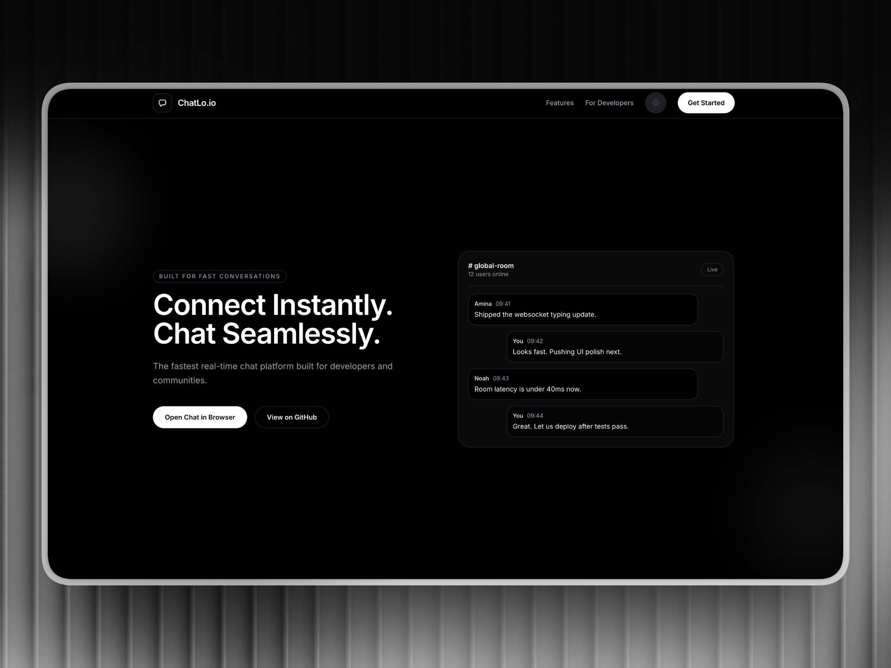

<p align="center">
  
</p>

<p align="center">
  
  
  
  
  
  
  
</p>

<h1 align="center">ChatLo.io</h1>

<p align="center">
  A full-stack real-time chat application built with <strong>WebSockets</strong>, <strong>React</strong>, and <strong>Node.js</strong>.<br/>
  Deployed with a high-performance decoupled architecture.
</p>

<p align="center">
  <strong>🌐 Live Site:</strong> <a href="https://chat.zafarr.xyz">chat.zafarr.xyz</a><br/>
  <strong>🔌 WebSocket API:</strong> <code>wss://chat-api.zafarr.xyz</code>
</p>

<p align="center">
  <a href="#-features">Features</a> •
  <a href="#-tech-stack">Tech Stack</a> •
  <a href="#-architecture">Architecture</a> •
  <a href="#-quick-start">Quick Start</a> •
  <a href="#-project-structure">Project Structure</a> •
  <a href="#%EF%B8%8F-configuration">Configuration</a>
</p>

---

## 🚀 Features

### Messaging
- **Real-Time Global Chat**: Instant broadcasting to all users.
- **Private & Secret DMs**: Direct 1-on-1 messaging with member selection.
- **Voice Messages**: Record and play audio notes with a custom UI player.
- **Rich Media**: Support for images, videos, files, and location pins.
- **Live Camera**: Capture and send photos directly from the browser.
- **Typing Indicators**: Real-time visual feedback when others are typing.

### Groups & Rooms
- **Multi-Room Support**: Join multiple channels simultaneously.
- **Interactive Invites**: Create groups and invite members via action cards.
- **Persistent Status**: Users can set custom status messages and avatars.

### Security & UX
- **Rate Limiting**: Throttling to prevent spam and abuse.
- **Dark/Light Mode**: Smooth theme transitions with persisted preferences.
- **Responsive Design**: Mobile-first UI with framer-motion animations.

---

## 🛠 Tech Stack

### Frontend
- **React 19**: Modern UI component library.
- **Tailwind CSS v4**: Utility-first styling with modern design tokens.
- **Framer Motion**: Smooth micro-interactions and transitions.
- **Vite**: Ultra-fast build tool and dev server.

### Backend
- **Node.js & TypeScript**: Type-safe server logic.
- **ws (WebSockets)**: Raw socket connections for maximum performance.
- **Express**: HTTP management and routing.
- **PM2**: Production process manager with auto-restart.

### Infrastructure
- **Vercel**: Static frontend hosting with global CDN.
- **AWS EC2 (Ubuntu)**: High-performance backend hosting for persistent sockets.
- **Cloudflare**: DNS management and SSL/TLS termination.
- **Nginx**: Reverse proxy and load balancing.

---

## 🏗 Architecture

ChatLo.io uses a **Decoupled Architecture**:
1. **Frontend (Vercel)**: Deployed at `chat.zafarr.xyz`. It serves static assets globally.
2. **Backend (AWS EC2)**: Deployed at `chat-api.zafarr.xyz`. A dedicated Linux instance running Node.js managed by PM2.
3. **Communication**: The frontend connects to the backend via a secure `wss://` WebSocket tunnel proxied through Nginx and Cloudflare.

---

## 📁 Project Structure

```
ChatLo.io/
├── FE/                   ← Frontend (React + Vite)
│   ├── src/context/      ← Core WebSocket Logic
│   └── src/components/   ← UI Components
├── BE/                   ← Backend (Node.js + ws)
│   ├── src/handlers/     ← Socket Message Routing
│   └── src/services/     ← Business Logic
└── README.md
```

---

## ⚙️ Configuration

### Backend (.env)
- `PORT`: Server port (default 3000)
- `AUTH_ENABLED`: Toggle JWT authentication
- `WS_ALLOWED_ORIGINS`: CORS whitelist for WebSocket origins

### Frontend (.env)
- `VITE_WS_URL`: The production WebSocket endpoint (`wss://chat-api.zafarr.xyz`)

---

<p align="center">
  Made with ❤️ by Zafar
</p>
| Run compiled build |
| Token | `npm run generate-token -- <name>` | Generate JWT |

### Frontend (`FE/`)

| Script | Command | Description |
|--------|---------|-------------|
| Dev | `npm run dev` | Vite dev server (port 5173) |
| Build | `npm run build` | Production build |
| Preview | `npm run preview` | Preview production build |

---

<p align="center">
  Made with ❤️ using WebSockets + React
</p>
